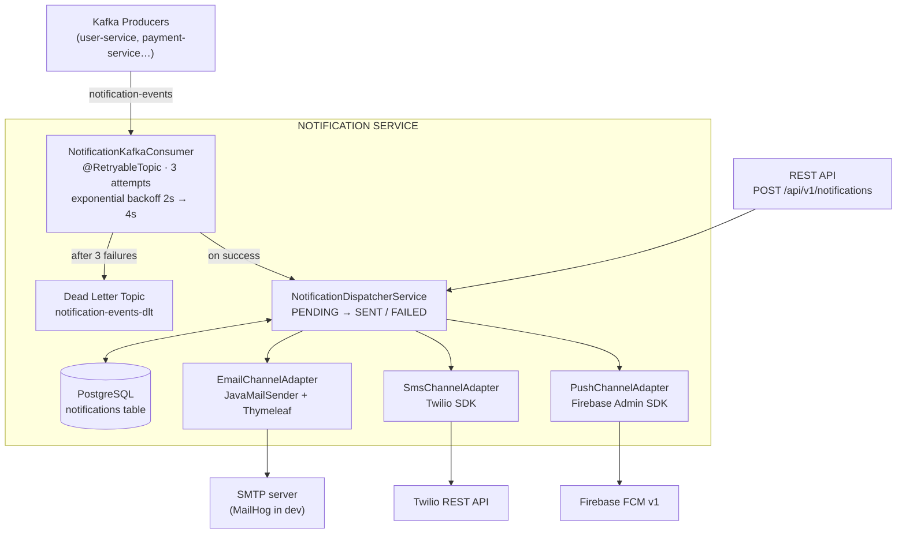

# notification-service

[](https://github.com/M-Touiti/notification-service/actions/workflows/ci.yml)


A production-grade multi-channel notification microservice built with Spring Boot 3. Delivers notifications via Email (HTML templates), SMS (Twilio), and Push (Firebase FCM), driven by Kafka events with full retry strategy and status tracking.

Built as a project showcasing third-party API integrations, event-driven architecture, and template-driven communication — skills directly applicable to SaaS, fintech, and e-commerce platforms.

---

## Architecture



---

## Features

| Feature | Details |
|---|---|
| **Email** | HTML templates with Thymeleaf (5 templates), JavaMailSender, any SMTP provider |
| **SMS** | Twilio REST API, test mode (no real calls) for local dev |
| **Push** | Firebase FCM v1, test mode for local dev |
| **Kafka consumer** | `@RetryableTopic` — 3 retry attempts with exponential backoff |
| **Dead Letter Topic** | Failed events go to `notification-events-dlt` for manual review |
| **Status tracking** | PENDING → SENT / FAILED stored in PostgreSQL |
| **Multi-channel** | One event can trigger EMAIL + SMS + PUSH simultaneously |
| **Pagination** | All list endpoints paginated |
| **Error handling** | RFC 7807 ProblemDetail responses |
| **Tests** | Unit (Mockito) + integration (GreenMail + Testcontainers) |

---

## Notification Templates

| Template | Email Subject | SMS Text |
|---|---|---|
| `WELCOME` | Welcome to our platform, {name}! | Welcome {name}! Your account is ready. |
| `OTP` | Your verification code: {code} | Your code is {code}. Valid for {expiresIn} min. |
| `PAYMENT_RECEIVED` | Payment of {amount} {currency} confirmed | Payment confirmed: {amount} {currency} on {date}. |
| `PASSWORD_RESET` | Reset your password | Reset your password: {resetLink} |
| `ACCOUNT_SUSPENDED` | Important: Your account has been suspended | Your account has been suspended. Contact support. |
| `GENERIC` | {subject} | {message} |

---

## Tech Stack

- **Java 21** — Records, switch expressions, virtual threads
- **Spring Boot 3.3** — Web, Mail, Thymeleaf, Actuator
- **Spring Kafka 3.2** — Consumer, `@RetryableTopic`, DLT
- **Spring Data JPA** — PostgreSQL notification status tracking
- **Thymeleaf** — HTML email templates (5 templates)
- **Twilio SDK 9.14** — SMS delivery (test mode for local dev)
- **Firebase Admin SDK 9.2** — FCM push (test mode for local dev)
- **GreenMail** — Embedded SMTP server for email integration tests
- **Testcontainers** — Real PostgreSQL in integration tests
- **MailHog** — Local email UI (Docker)
- **Docker / Docker Compose** — Full local environment

---

## Getting Started

### Prerequisites
- Java 21+
- Docker & Docker Compose

### Run locally (full stack via Docker Compose)

```bash
# 1. Clone the repo
git clone https://github.com/M-Touiti/notification-service.git
cd notification-service

# 2. Start everything (builds the app image + PostgreSQL + Kafka + MailHog)
docker-compose up -d

# 3. Open Swagger UI
open http://localhost:8080/swagger-ui.html

# 4. Open MailHog to see sent emails
open http://localhost:8025

# 5. Open Kafka UI
open http://localhost:8081
```

### Run locally (app on host, infrastructure in Docker)

```bash
# 1. Start only infrastructure
docker-compose up -d postgres zookeeper kafka mailhog kafka-ui

# 2. Build and run with the local profile
#    - SMTP points to MailHog (localhost:1025) — no credentials needed
#    - SMS and Push run in test/log mode — no real credentials needed
mvn clean install -DskipTests
mvn spring-boot:run -pl exposition -Dspring-boot.run.profiles=local
```

Preview emails sent locally at **http://localhost:8025** (MailHog).

### Run tests

```bash
# Unit tests (Mockito — no infrastructure required)
mvn test -pl domain,application

# Integration tests (GreenMail + Testcontainers — requires Docker)
mvn verify -pl exposition
```

---

## API Reference

### Send a notification

```bash
POST /api/v1/notifications
Content-Type: application/json

{
  "recipientId": "user-123",
  "channels": ["EMAIL", "SMS"],
  "template": "PAYMENT_RECEIVED",
  "params": {
    "amount": "150.00",
    "currency": "EUR",
    "date": "2025-06-01",
    "reference": "TXN-001"
  },
  "email": "user@example.com",
  "phone": "+33612345678"
}
```

Response:
```json
[
  {
    "id": "uuid-email",
    "channel": "EMAIL",
    "status": "SENT",
    "sentAt": "2025-06-01T14:30:00"
  },
  {
    "id": "uuid-sms",
    "channel": "SMS",
    "status": "SENT",
    "sentAt": "2025-06-01T14:30:01"
  }
]
```

### Query notifications

```bash
# Get by ID
GET /api/v1/notifications/{id}

# Get by recipient (paginated)
GET /api/v1/notifications?recipientId=user-123&page=0&size=20

# Get failed notifications (for monitoring)
GET /api/v1/notifications/status/FAILED
```

---

## Kafka Integration

### Publish a notification event (from another service)

```bash
docker exec -it notification-kafka-1 \
  kafka-console-producer \
  --bootstrap-server localhost:9092 \
  --topic notification-events \
  --property "parse.key=true" \
  --property "key.separator=:"

# Then paste:
user-123:{"recipientId":"user-123","channels":["EMAIL"],"template":"WELCOME","params":{"name":"Alice"},"email":"alice@example.com","phone":null,"fcmToken":null}
```

### Retry topics and DLT

| Topic | Description |
|---|---|
| `notification-events` | Main input topic |
| `notification-events-retry-0` | Retry attempt 1 (2s delay) |
| `notification-events-retry-1` | Retry attempt 2 (4s delay) |
| `notification-events-dlt` | Dead Letter Topic (permanent failures) |

---

## Configuring Real Credentials

### Twilio (SMS)
```yaml
# application.yml or environment variables
TWILIO_ACCOUNT_SID: ACxxxxxxxxxxxxxxxxxx
TWILIO_AUTH_TOKEN: your_auth_token
TWILIO_FROM_NUMBER: "+15005550006"
```

### Firebase (Push)
```yaml
FIREBASE_CREDENTIALS_PATH: /path/to/firebase-credentials.json
```

### SMTP (Email)
```yaml
SMTP_HOST: smtp.gmail.com
SMTP_PORT: 587
SMTP_USERNAME: your@gmail.com
SMTP_PASSWORD: your_app_password
```

> Without real credentials, the service runs in **test mode** — SMS and Push are logged to console instead of being sent. Email can be previewed in **MailHog** at http://localhost:8025.

---

## Project Structure

```
notification-service/
├── domain/              Pure business model (Notification, enums, exceptions)
├── application/         Use cases, ports (EmailChannelPort, SmsChannelPort, ...)
│                        NotificationDispatcherService
├── infrastructure/      Channel adapters (Email/SMS/Push), Kafka consumer,
│                        Thymeleaf templates, JPA adapter
│   └── templates/email/ welcome.html, otp.html, payment_received.html...
└── exposition/          REST controllers, GlobalExceptionHandler, application.yml
    └── test/            Unit (Mockito) + Integration (GreenMail + Testcontainers)
```

---

## Design Decisions

**Why store PENDING before the channel call?**
If the service crashes mid-flight, the PENDING record serves as an audit trail. A monitoring job can detect stuck PENDING notifications and retry or alert ops.

**Why separate channel ports per channel instead of one generic port?**
Each channel has fundamentally different failure modes (SMTP timeout vs Twilio rate limit vs FCM token expired). Separate interfaces allow independent mocking in tests and separate circuit breakers in production.

**Why GreenMail over MockMvc for email tests?**
GreenMail runs a real SMTP server and captures actual email objects, allowing assertions on subject, recipient, and MIME content. This tests the full JavaMailSender + Thymeleaf rendering pipeline — not just a mock.

**Why MailHog in Docker Compose?**
MailHog intercepts SMTP traffic locally and provides a web UI to inspect email HTML rendering without sending anything to real recipients. Essential for email template development.

---

## License

MIT
